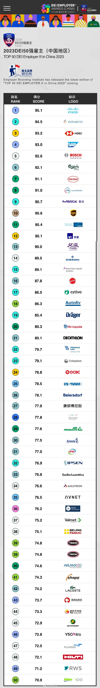

# ESG企业黑名单
* 这里是ESG企业黑名单的README文件
* 这里记录了所有被列入ESG黑名单的企业，包括他们的名称、所在行业、进入黑名单原因等信息。
* **进入黑名单的原因包括:**
 - 企业加入ESG组织
 - 企业对于极端女权保持友好态度,或企业对极端女权组织或个人进行资金支持
 - 企业邀请极端女权人士参加活动
 - 企业将男性员工或顾客的劳动剩余价值和产生的利润无偿转移给女性员工或顾客
 - 企业对于LGBTQ群体保持友好态度,或企业对LGBTQ+组织或个人进行资金支持
 - 企业邀请LGBTQ人士参加活动
 - 企业将男性员工或顾客的劳动剩余价值和产生的利润无偿转移给LGBTQ+员工或顾客
 - 企业为了扩大商业版图,无视基本老顾客的利益,将老顾客的利益置于次要地位,以此来讨好少数白左群体.
 - 企业加入SBI,或者遵从SBI的指示
 - 企业内有DEI部门,或者遵从DEI部门的指示
 - 进入彭博社性别平等指数GEI名单
* 这些信息将帮助我们更好地了解进入ESG黑名单的企业目前的情况，并采取相应的措施。
* 请注意，ESG黑名单是动态更新的，我们将在后续的更新中添加更多信息。
* 如果您有任何问题或建议，请随时联系我们。
* 以下是网友找到的 2024 DEI 雇主大奖的获奖名单
    
* 以下是网友找到的 2023 DEI 雇主大奖的获奖名单
    
* 以下是网友找到的邀请极端女权人士杨笠参加活动或有联系的企业的名单
    
* **谢谢您的支持！**
* # 鸣谢
    - 原神内鬼吧
    - 星塔旅人玩家
